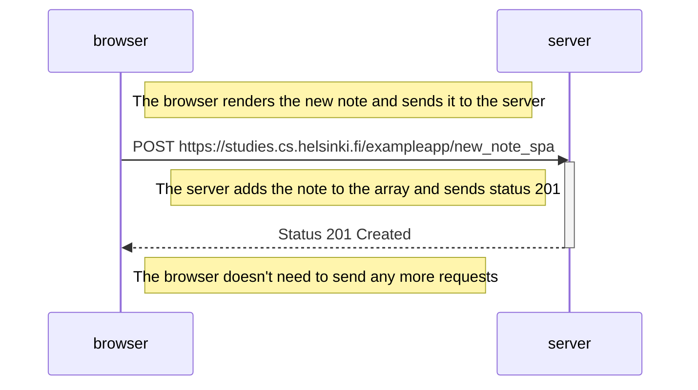

```mermaid
    sequenceDiagram
        participant browser
        participant server

        Note right of browser: The browser renders the new note and sends it to the server

        browser->>server: POST https://studies.cs.helsinki.fi/exampleapp/new_note_spa
        activate server

        Note left of server: The server adds the note to the array and sends status 201

        server-->>browser: Status 201 Created
        deactivate server

        Note right of browser: The browser doesn't need to send any more requests
```